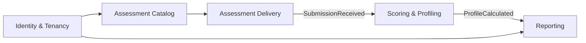

# 02 · Domínio (DDD)

## Linguagem ubíqua

| Termo                              | Significado                                                    |
| ---------------------------------- | -------------------------------------------------------------- |
| **Tenant / Empresa**               | Organização cliente que aplica testes.                         |
| **Tipo de teste (AssessmentType)** | Modelo de teste (ex.: DISC).                                   |
| **Questionário (Questionnaire)**   | Versão publicada de um tipo, com grupos de perguntas.          |
| **Grupo (QuestionGroup)**          | Conjunto de 4 afirmações/adjetivos, cada um ligado a um fator. |
| **Convite (Invitation)**           | Link único para um candidato responder um questionário.        |
| **Candidato (Candidate)**          | Pessoa que responde.                                           |
| **Submissão (Submission)**         | Conjunto de respostas enviado.                                 |
| **Fator**                          | D, I, S ou C.                                                  |
| **Perfil (Profile)**               | Resultado calculado: pontuações, primário, secundário.         |

## Bounded contexts

| Contexto            | Responsabilidade                                  | Agregado raiz                   |
| ------------------- | ------------------------------------------------- | ------------------------------- |
| Identity & Tenancy  | Empresas, usuários, papéis, autenticação          | `Tenant`, `User`                |
| Assessment Catalog  | Tipos e versões de questionário                   | `Questionnaire`                 |
| Assessment Delivery | Convites, identificação, recebimento de respostas | `Invitation`, `Submission`      |
| Scoring & Profiling | Cálculo e interpretação                           | `Profile` (domain service puro) |
| Reporting           | Leitura otimizada, filtros, exportação            | Read models (sem agregados)     |

## Agregados e invariantes

- **Invitation**: pertence a um tenant; estados `PENDING → STARTED → COMPLETED | EXPIRED | REVOKED`; só aceita uma submissão; token com hash armazenado.
- **Submission**: contém `Answer[]`; invariantes: uma resposta por opção; em cada grupo os valores são exatamente {1,2,3,4}; todos os grupos respondidos.
- **Profile**: value object imutável com `Score(D,I,S,C)`, `primary`, `secondary`, `code` (combinação ordenada, 12 variantes), `gap` e `tied` (empate técnico, derivados das pontuações) e `questionnaireVersion`.
- **Questionnaire**: versionado e imutável após publicado (resultados antigos continuam reprodutíveis).

## Value objects

`Email`, `Phone` (E.164), `BirthDate`, `Score`, `Factor`, `RankValue (1..4)`, `InvitationToken`.

## Eventos de domínio

`InvitationCreated`, `InvitationOpened`, `SubmissionReceived`, `ProfileCalculated`, `InvitationExpired`.
O cálculo do perfil reage a `SubmissionReceived` (síncrono no MVP, trocável por fila).

## Regras de dependência

`domain` não importa nada de framework. `application` depende só de `domain` e portas. `infra` implementa portas.
