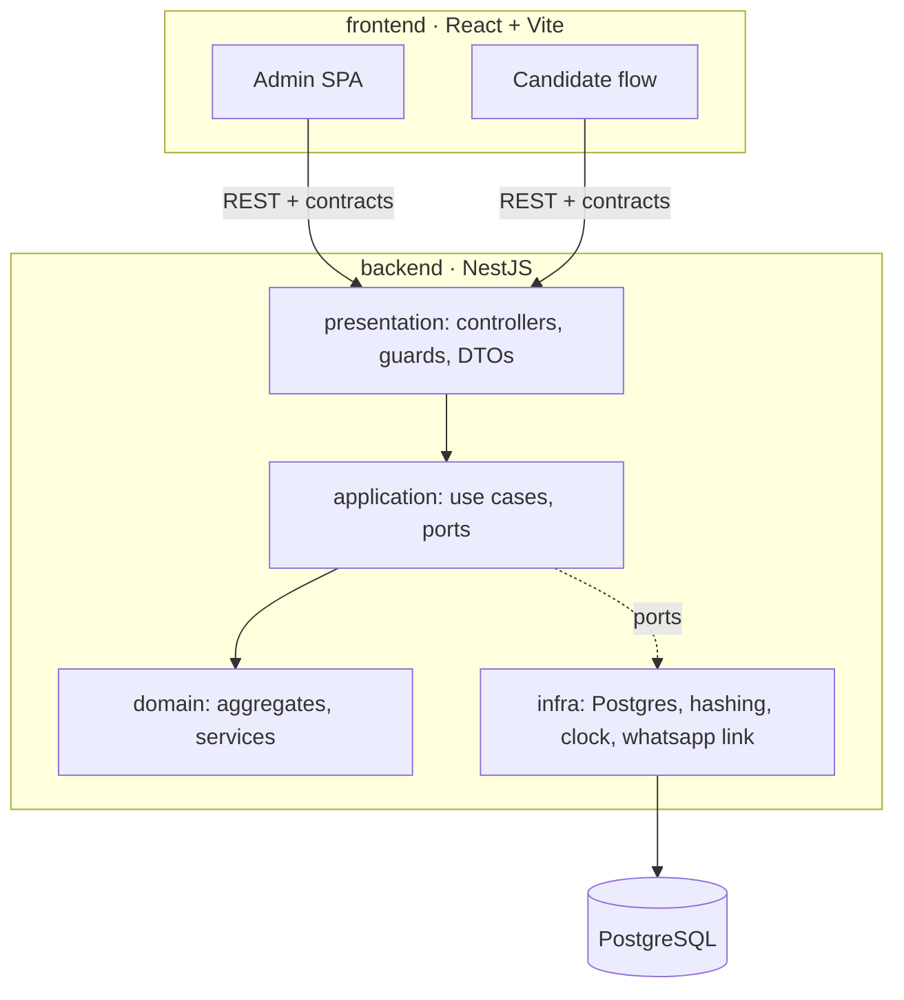

# 03 · Arquitetura

## Visão geral



## Monorepo (pnpm workspaces + Turborepo)

```
backend/      NestJS
frontend/     React + Vite + TypeScript
packages/
  contracts/  schemas Zod + tipos compartilhados (fonte única dos DTOs)
  disc-core/  (opcional) domínio puro do cálculo, reutilizável no front para preview
  config/     eslint, tsconfig, prettier
docs/
```

## Backend (NestJS, hexagonal)

```
src/
  modules/<contexto>/
    domain/         entidades, VOs, eventos, domain services
    application/    commands/queries, handlers, ports (interfaces)
    infra/          repositórios, adapters, mappers ORM↔domínio
    presentation/   controllers, guards, pipes
  shared/           kernel (Result, DomainEvent, Clock, IdGenerator)
```

- **CQRS leve**: comandos via use cases; queries de relatório leem direto de views/read models.
- **Multi-tenancy**: coluna `tenant_id` + Row Level Security no Postgres; `TenantContext` por request (AsyncLocalStorage).
- **Validação**: Zod (contracts) nos limites; invariantes no domínio.
- **Auth**: JWT de acesso curto + refresh rotativo em cookie httpOnly; Argon2id; RBAC por guard.
- **Docs de API**: OpenAPI gerado; rate limit (`@nestjs/throttler`) nas rotas públicas.
- **Eventos**: `EventEmitter` in-process no MVP, porta `EventBus` permite BullMQ depois.

## Frontend (React)

- Vite + TypeScript estrito, React Router, **TanStack Query**, **React Hook Form + Zod**, **Tailwind + shadcn/ui (Radix)**, i18n pronto (pt-BR padrão).
- Organização feature-sliced: `app/ pages/ features/ entities/ shared/`.
- Fluxo do candidato é rota separada com code-splitting para bundle mínimo.
- Reordenação 1–4: seleção por toque (não drag), estado em `useReducer`, persistência em `localStorage`.

## Qualidade transversal

Ver `09-qualidade-devops.md`. Decisões em `adr/`.
