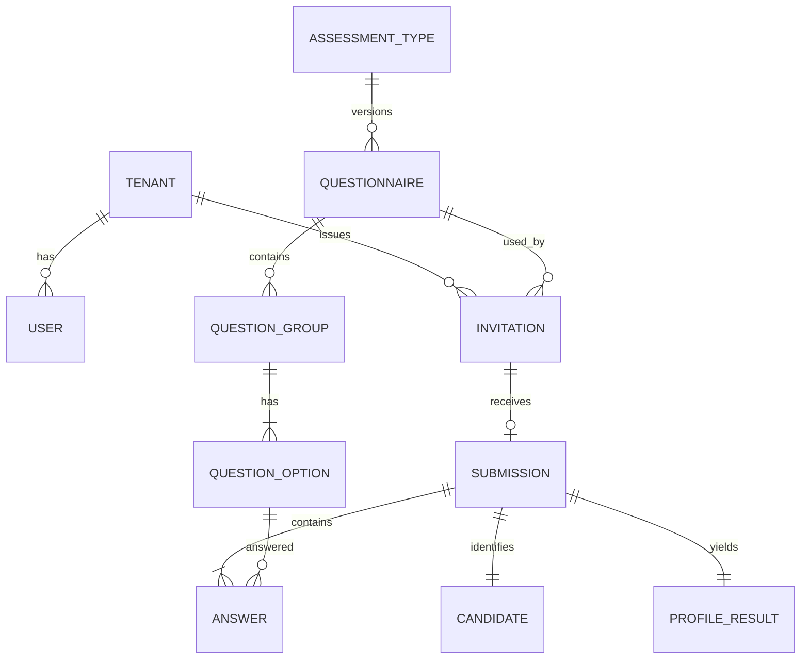

# 04 · Modelo de Dados (PostgreSQL)

## Tabelas principais

| Tabela            | Campos-chave                                                                                                                           |
| ----------------- | -------------------------------------------------------------------------------------------------------------------------------------- |
| `tenant`          | id, name, slug (unique), retention_days (padrão 365), created_at                                                                       |
| `user`            | id, tenant_id, name, email (unique por tenant), password_hash, role (`ADMIN`/`RECRUITER`), active                                      |
| `assessment_type` | id, code (`DISC`), name                                                                                                                |
| `questionnaire`   | id, assessment_type_id, version, status (`DRAFT`/`PUBLISHED`), published_at; unique(type, version)                                     |
| `question_group`  | id, questionnaire_id, position                                                                                                         |
| `question_option` | id, group_id, label, factor (`D`/`I`/`S`/`C`), position                                                                                |
| `invitation`      | id, tenant_id, questionnaire_id, token_hash (unique), created_by, status, expires_at, target_role, target_department, created_at       |
| `submission`      | id, tenant_id, invitation_id (unique), submitted_at, idempotency_key, consent_at, consent_version                                      |
| `candidate`       | id, submission_id (unique), tenant_id, name, phone, email, job_title, department, birth_date                                           |
| `answer`          | id, submission_id, option_id, rank smallint check (1..4); unique(submission_id, option_id)                                             |
| `profile_result`  | id, submission_id (unique), score_d, score_i, score_s, score_c, primary_factor, secondary_factor, questionnaire_version, calculated_at |
| `refresh_token`   | id, user_id, token_hash (unique), expires_at, revoked_at                                                                               |
| `audit_log`       | id, tenant_id, user_id, action, entity_type, entity_id, created_at                                                                     |

## Regras no banco

- `answer.rank` com `CHECK (rank BETWEEN 1 AND 4)`.
- Não repetir valor no grupo: coluna denormalizada `group_id` em `answer` + `UNIQUE (submission_id, group_id, rank)`; e `UNIQUE (submission_id, option_id)`.
- `invitation.submission` única (`UNIQUE invitation_id`) garante uso único.
- **Isolamento**: `tenant_id` em todas as tabelas de negócio, com **RLS ativo** (papel `disc_app`, contexto `app.tenant_id` por transação). Rotas públicas do candidato resolvem o tenant pelo token do convite via função `SECURITY DEFINER`. Ver ADR-003.
- `idempotency_key` não é único globalmente: a unicidade de `invitation_id` já garante uma submissão por convite, e a chave só decide se um reenvio é replay ou conflito.
- `profile_result` guarda só as pontuações e os fatores primário/secundário. O **código combinado, a diferença e o empate são derivados na leitura** (a coluna `tied` foi removida na migration `drop_profile_tied`), para o limite de empate poder mudar sem deixar dados antigos inconsistentes.
- IDs UUID v7; timestamps `timestamptz`.

## Índices para relatórios

`profile_result(primary_factor)`, `candidate(tenant_id, job_title)`, `candidate(tenant_id, department)`, `submission(tenant_id, submitted_at desc)`, `candidate` busca por nome com `pg_trgm`.

## Migrations

Versionadas e imutáveis, aplicadas no CI e no deploy; seed do questionário DISC v1 em migration dedicada.
